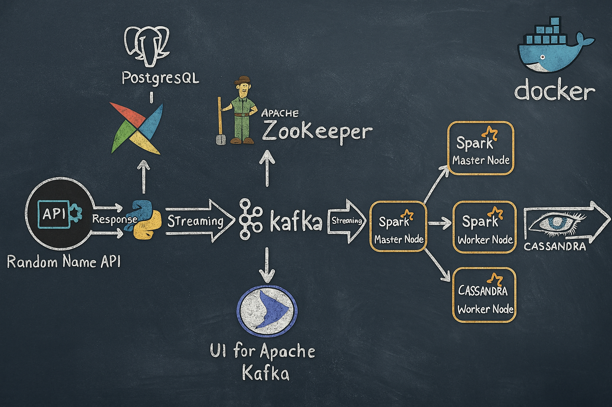

# 🚀 Real-Time Structured Streaming Data Pipeline

This project demonstrates a robust, end-to-end data engineering pipeline designed to ingest, stream, process, and store data in real-time. Built on modern technologies such as Apache Airflow, Kafka, Spark Structured Streaming, and Cassandra, the system is fully containerized using Docker for ease of deployment and scalability.

---

## 🎯 Project Overview

The pipeline fetches user data dynamically from a live API, publishes it onto Kafka topics using Apache Airflow DAGs, processes this data in real-time with Apache Spark, and finally persists the transformed data into Apache Cassandra.

---

## 🧩 System Architecture



## 📌 Key Components

* **Data Source:** Fetches random user data via the [randomuser.me](https://randomuser.me/) API.
* **Apache Airflow:** Schedules and orchestrates API data retrieval and Kafka publishing tasks.
* **Apache Kafka & Zookeeper:**  Stream data from PostgreSQL to Spark.
* **Apache Spark Structured Streaming:** Processes Kafka streams, applying real-time transformations.
* **Apache Cassandra:** Provides a highly available NoSQL storage solution for processed data.

---

## 📂 Project Structure

```bash
.
├── dags/
│   └── kafka_stream.py           # Airflow DAG for API ingestion and Kafka publishing
├── script/
│   └── entrypoint.sh             # Initialization scripts for Airflow
├── spark_stream.py               # Spark Structured Streaming job
├── docker-compose.yaml           # Docker Compose configuration
├── requirements.txt              # Python dependencies
└── README.md                     # This document
```

---

## ⚙️ Getting Started

Follow these steps to set up the project locally:

### 1. Clone the Repository

```bash
git clone <your-repository-link>
cd <your-project-directory>
```

### 3. Initialize and Start Docker Containers

```bash
docker compose up airflow-init
docker compose up -d
```

### 4. Deploy Spark Structured Streaming Job

Copy dependencies and Spark script to Spark container:

```bash
docker cp dependencies.zip spark-master:/dependencies.zip
docker cp spark_stream.py spark-master:/spark_stream.py
```

Execute Spark job:

```bash
docker exec -it spark-master spark-submit \
  --packages com.datastax.spark:spark-cassandra-connector_2.12:3.5.1,org.apache.spark:spark-sql-kafka-0-10_2.12:3.5.1 \
  --py-files /dependencies.zip \
  /spark_stream.py
```

---

## 🔍 Monitoring and Validation

### **Apache Airflow UI:**

* URL: [http://localhost:8080](http://localhost:8080)
* Credentials: `admin` / `admin`
* Unpause DAG to start data ingestion.

### **Apache Kafka UI:**

* URL: [http://localhost:8085](http://localhost:8085)
* Monitor real-time messages and Kafka topic status.

### **Apache Cassandra Validation:**

Check data insertion via Cassandra's cqlsh:

```bash
docker exec -it cassandra cqlsh -u cassandra -p cassandra localhost 9042
```

Check tables and data:

```sql
DESCRIBE KEYSPACES;
SELECT * FROM spark_streaming.created_users;
SELECT count(*) FROM spark_streaming.created_users;
```


## 🛠 Technologies Useds

* Python
* Apache Airflow
* Apache Kafka
* Apache Zookeeper
* Apache Spark 
* Apache Cassandra
* PostgreSQL
* Docker

